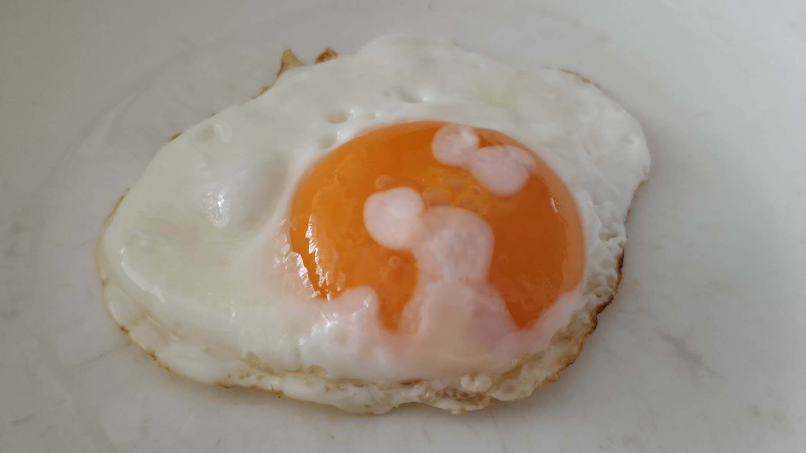

# 中餐

---

### 水煮蛋 = 荷包蛋（poached egg）：

加适量水煮开，&nbsp;**火调小至水不沸腾**，将蛋&nbsp;**从水表面**&nbsp;或&nbsp;**沿锅边**&nbsp;打入水中，**溏不溏心完全看水温，锅、灶不同情况不同（<https://www.zhihu.com/question/20146449/answer/19819168>）**，完成后&nbsp;**看个人感觉加糖即可**。

- 鸡蛋尽量保证&nbsp;**新鲜**，新鲜的蛋蛋清会很好地包裹蛋黄！盖锅盖可以帮助更好地成形，也可让不新鲜的蛋清更好的包裹蛋黄。
- （选）可借助物品使蛋更好地凝固定形：1、可先将蛋&nbsp;**打入碗里**，再用碗倒下锅。2、可将蛋&nbsp;**打入汤勺中**，一起下锅。
- （选）可使用小技巧更好地凝固：1、在水中加少许&nbsp;*醋*，不过会留有醋味。2、可以&nbsp;*把水搅旋转起来*，也可使蛋更好凝固。

```
Tips:
1. https://www.bilibili.com/video/av35523105。
2. https://www.youtube.com/watch?v=FztBAf-1wgc。
3. 一些需要蛋有良好形状的做法，都可先将蛋打入碗里。
```


---

### 煎蛋（fried egg）：

1、单面煎蛋（sunny side up）：**热锅冷油加盐**，打入鸡蛋&nbsp;**小火煎1-2分钟**&nbsp;即成，更细节参见&nbsp;<https://www.bilibili.com/video/av46323895>。  
2、双面煎蛋（over easy/medium/hard）：同单面煎蛋，不过是双面都煎而已，**1-2分钟溏心**，**3分钟往上实心**。  
3、煎荷包蛋：<https://www.youtube.com/watch?v=BryYfPCFnbo>。

- （选）可不加盐配酱油吃，不加盐胶质感小。

```
Tips:
很多蛋的做法中，想让蛋更好看、更细腻，都可以过筛去掉很稀的部分。
```



---

### 煮、煎蛋相关做法：

<https://www.zhihu.com/question/23965078>


---

### 蒸蛋 = 鸡蛋羹（steamed egg = egg custard）：

1、嫩滑：<https://www.youtube.com/watch?v=jzJ63sc5gck&t=85s>，参考见&nbsp;<https://www.bilibili.com/video/av66367989>。  
2、蜂窝蛋：你只要随意操作，怎样都会是蜂窝。

- 任何混入空气的操作都会让蒸蛋出现蜂窝：**1、加盐+兑凉/温开水 或 高汤。2、去气泡。3、静置2分钟。**
- 盐或高汤中含有电解质，会帮鸡蛋凝固。
- 蒸至&nbsp;**表面没有水洼，能整体倾斜**&nbsp;关火。
- （选）用水蒸可改用&nbsp;*微波炉*&nbsp;蒸，*解冻模式*，据自家情况定时长即可。
- （选）可在蛋液中加各种东西一起蒸，例如虾仁等。 


---

### 茶叶蛋（tea egg）：

<>


---

### 虎皮鸡蛋（tiger egg）：

<https://www.zhihu.com/question/329076276>，<https://www.bilibili.com/video/av44669262>。

- 防止煮蛋时裂开：1、**水中加盐**&nbsp;或&nbsp;**在蛋后戳小孔**。2、水开后&nbsp;**大火最多1-2分钟**，然后必须转中小火。
- 煮出的蛋是否溏心，是否有“灰质”取决于煮的时间。
- 卤汁：**先加油爆香=炝锅&nbsp;葱段、姜片、八角=大料、桂皮（干辣椒、花椒、香叶可选），再倒水加&nbsp;1勺老抽、2勺生抽、一点耗油、盐、糖（少量料酒、大量啤酒可选）**。


---

### 糖拌西红柿（tomato slices with sugar）

西红柿切好放盘，**先撒大量糖**，**后撒一丁丁丁点盐**，即可。

- 西红柿太硬（青）、太软（熟）都不好吃，**软硬适中的**&nbsp;最好！
- （选）完成后可放入冰箱冻一会。


---

### 西红柿炒蛋（stir-fried tomato with eggs）

1、鸡蛋打匀&nbsp;**加一丁点盐和水**，**热油**&nbsp;炒好盛出&nbsp;->&nbsp;加油炒西红柿&nbsp;**至出汁**，再放鸡蛋稍炒，**加盐加糖加葱花**&nbsp;即可出锅。  
2、更多参见：<https://www.youtube.com/watch?v=IG7t-P3PHN0>，<https://www.bilibili.com/video/av15414207>。

- 根据个人喜好决定西红柿和蛋的量，**一般西红柿2颗，蛋2颗**&nbsp;即可。
- 根据个人喜好决定糖盐比例，**咸1:2，中1:1（1/2茶匙），甜2:1**。
- （选）先炒番茄先炒蛋，番茄包蛋蛋包番茄，都可。
- （选）葱花可先放可后放，放入蛋液中炒都可。
- （选）可&nbsp;*热水烫番茄，再放入冷水冷却*，以给番茄去皮，有利于出汁。
- （选）可加&nbsp;*白醋或糖*&nbsp;给蛋去腥，可加&nbsp;*白胡椒*&nbsp;给番茄去生气。
- （选）为了使番茄味更浓郁，可加&nbsp;*番茄酱*。
- （选）喜欢汤汁或特别软嫩，*可加水，然后水淀粉勾芡*。
- （选）喜欢酱香味可加&nbsp;*生抽*，最后加&nbsp;*香油*。

```
Tips:
1. 顺着西红柿底部凹槽切，不流汁。
2. 蛋液中加一点盐可去腥，加一点水可更嫩。
3. 加盐可帮出水，加糖可帮调味（如同味精）。
4. 很多菜中想吃更粘稠的口感，都可适时加水淀粉勾芡完成。
```


---

### 蛋炒饭（egg fried rice）

<>


